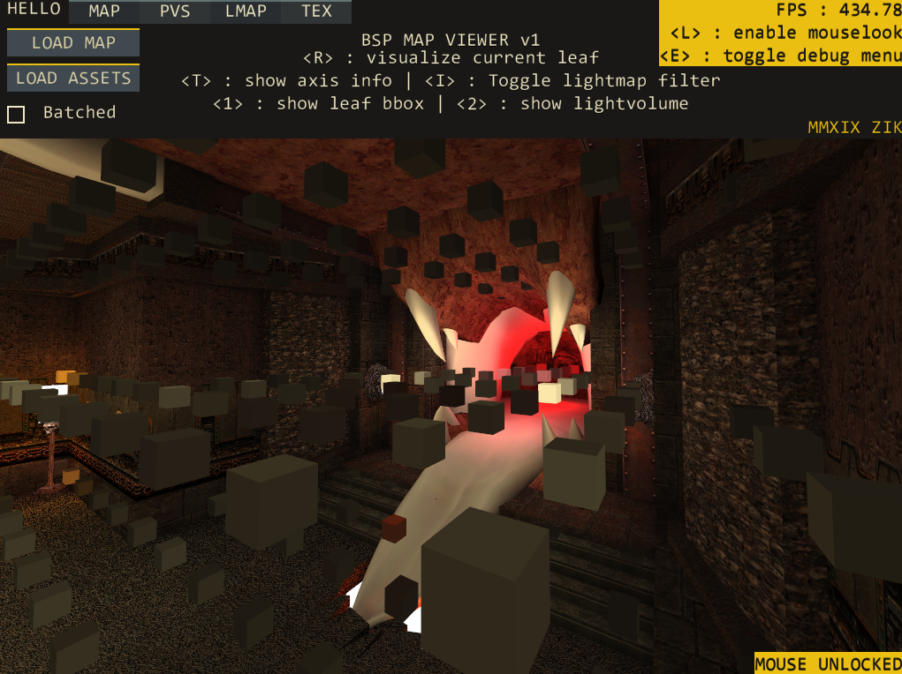
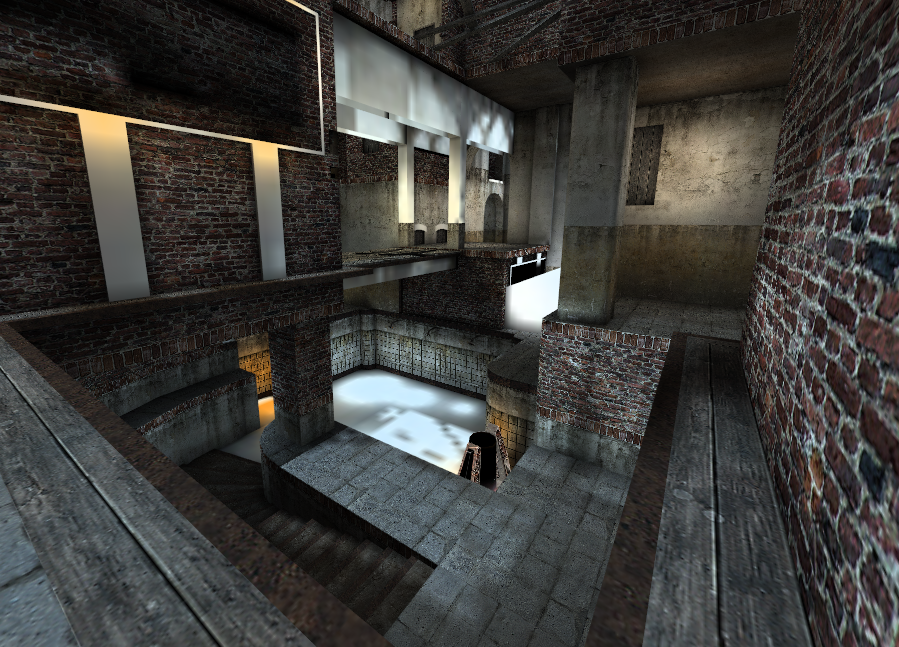
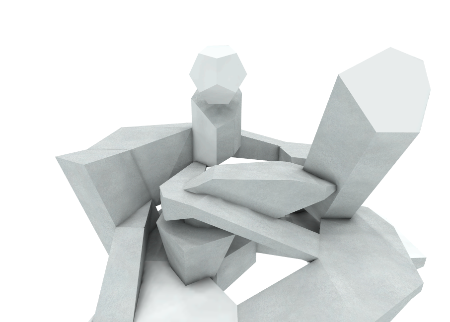
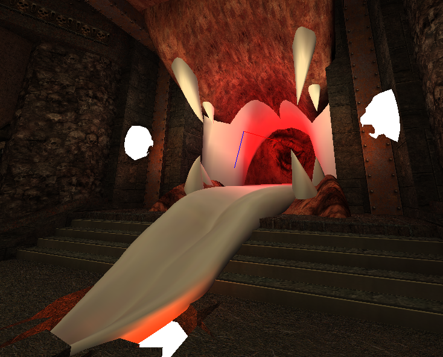
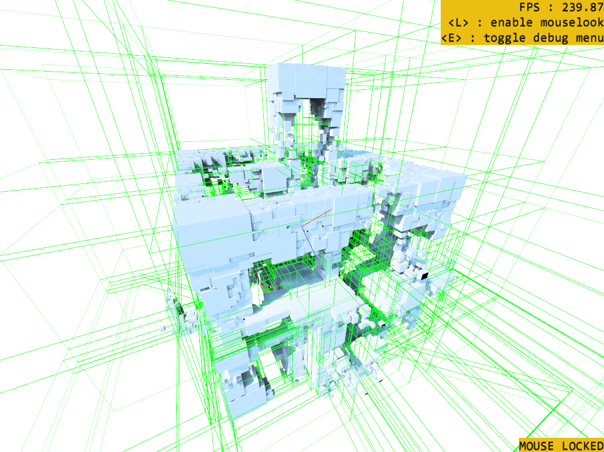
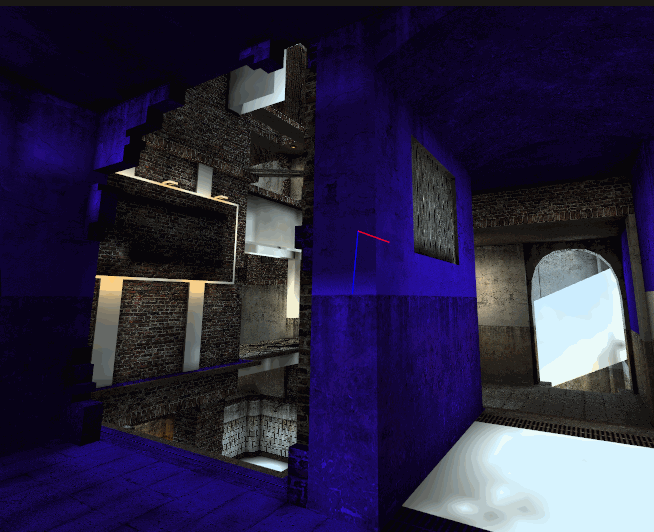
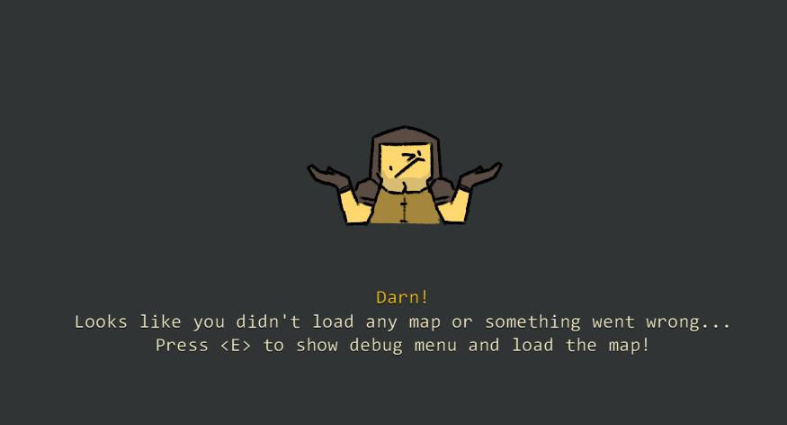
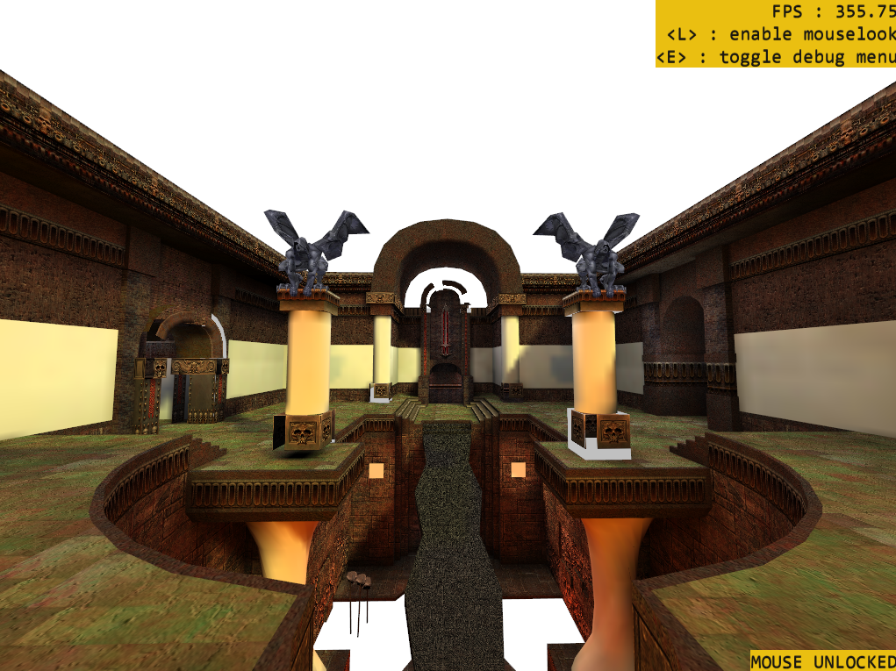

<h1 align="center"><i>QUAKE 3 MAP VIEWER :godmode:FOR GAMEMAKER : STUDIO:godmode:</i></h1>
<h3 align="center">An example project for Gamemaker : Studio on loading Quake 3's BSP files and rendering them</h3>
<h3 align="center">(legacy version : <a href="https://github.com/TandyRum1024/gml-q3-bsp-loader/tree/legacy">Link to legacy branch</a>)</h3>

Featuring :
====
 
* ***Texture mapping & lightmaps***

* ***PVS Culling***

 
* ***Bézier patch support***

 
* ***Debug visualizations (current leaf, leaf bbox, lightvolumes etc..)***

Usage :
====
Since including Quake 3's files and levels are against the copyright, **You'll need to prepare the BSP / ZIP / PK3 Files for yourself**. Practically you only need the map files for rendering, But to render the original Quake 3 Arena's bsp files properly, You'll also need a `pak0.pk3` from the Q3A. 
Getting the files from Quake 3 Arena's **demo** version (which is free on steam) is one of the viable options. 
You can press `<E>` to open up the menu and load your maps and assets.
* `<L>` to toggle mouselook
* `<E>` to toggle menu
* `<R>` to toggle current leaf visualization
* `<T>` to toggle camera vector visualization
* `<I>` to toggle lightmap texture filtering
* `<1>` to toggle leaf bounding box visualization
* `<2>` to toggle lightvolume visualization

When mouselook is disabled :
* Use mouse and UI to switch between menu

When mouselook is active :
* `WASD` to move, Mouse to look around

Todo :
====
* Implement Frustum culling for leafs
* Implement Quake 3's shader pipelines (This is one of the main reason why some textures are plain white)
* Fix performance issues on maps with a lot of faces
* Improve rendering method (Currently it draws face by face instead of batching by leaves for many reasons including level multitexturing)
* Implement entities loading
* Mesh rendering with lightvolume lighting
* Maybe even implement physics with raycasting & make some Defrag game on gamemaker? IDK. :feelsgood:

BSP Scripts overview
====
(All of the scripts are prefixed with `zbsp_*`)

***Basic stuff***

| Script | Description |
| ------ | ----------- |
| `zbsp_load_map(file, baseassets, buildlevelmesh, builddbugmesh)` | Loads Quake 3 map in `bsp/zip/pk3` format and returns `ds_map` containing informations of the map |
| `zbsp_free_map(map)` | Unloads & deletes the given map (returned from `zbsp_load_map()`) from memory |
| `zbsp_reset_baseassets(file)` | Loads base assets that is required for texturing the original Quake 3 maps, If set to -1, Clears the base assets directory. Base assets & files are stored in `C:\<USER>\AppData\Local\Q3_BSP`. |
| `zbsp_helper_vars()` | Helper variables for converting lump indexes into lump names in string, Getting sizes of each lumps entry, Enums for indexing BSP map data. |

***BSP Loading helpers*** (requires file buffer that contains bsp file)

| Script | Description | ds_map keys |
| ------ | ----------- | ----------- |
| `zbsp_load_lump_directory(buffer, map)` | Reads [directory](http://www.mralligator.com/q3/#Directory) part of the BSP file from given file buffer into the map | `"<lump_name>-diroff"`, `"<lump_name>-dirlen"` (for list of `<lump_name>`, refer to the ***Pre-defined BSP Lump names*** section below.) |
| `zbsp_load_lump_*(buffer, map)` | Reads lumps data from given file buffer into the map. | `"<lump_name>-data"`, `"<lump_name>-num"` |

***PVS related helper scripts*** (`bspdata` = map data returned from `zbsp_load_map()`)

| Script | Description |
| ------ | ----------- |
| `zbsp_get_leaf_idx(bspdata, x, y, z)` | Returns the index of leaf that given xyz position is inside of. |
| `zbsp_check_visible(bspdata, cluster, checkcluster)` | Checks if the given Visible cluster `checkcluster` is visible from `cluster` |
| `zbsp_get_visible_leafs(bspdata, list, cluster)` | Clears & adds the every visible leafs from `cluster` into the given `ds_list`, `list`. |

***Vertex buffer building helper scripts*** (`mapdata` = map data returned from `zbsp_load_map()`)

| Script | Description |
| ------ | ----------- |
| `zbsp_vb_build_faces(mapdata)` | Builds vertex buffer for every faces and stores it in the given `ds_map` with the key `"vb-faces"`, `"vb-format-face-tex"` (vertex format) |
| `zbsp_vb_build_faces_notexture(mapdata)` | Builds no-textured variant of vertex buffer for every faces and stores it in the given `ds_map` with the key `"vb-faces"`, `"vb-format-face-notex"` (vertex format) |
| `zbsp_vb_build_leafs_notexture(mapdata)` | Builds no-textured variant of vertex buffer for every leafs and stores it in the given `ds_map` with the key `"vb-leafs"`, `"vb-format-face-notex"` (vertex format) |

***Misc. helper scripts***

| Script | Description |
| ------ | ----------- |
| `zbsp_calc_bezier(a, b, c, lerpi2, lerp2, lil2)` | Returns quadratic bezier curve with 3 "control values" `a, b, c` with given co-efficients : `lerpi2` : `(1 - t) * (1 - t)` `lerp2` : `t * t` `lil2` : `t * (1 - t) * 2` |
| `zbsp_calc_lightdot(x1, y1, z1, x2, y2, z2, x3, y3, z3, vx, vy, vz)` | Returns the dot product (remapped into 0..1 range) of given triangle(`x1y1z1, x2y2z2, x3y3z3`)'s surface normal with given light vector(`vxvyvz`) |
| `zbsp_vb_build_leafs_notexture(mapdata)` | Builds no-textured variant of vertex buffer for every leafs and stores it in the given `ds_map` with the key `"vb-leafs"`, `"vb-format-face-notex"` (vertex format) |

Pre-defined BSP Lump names
====
*(refer to `global.BSPLumpNames[]` in `zbsp_helper_vars()` for more information)* The ds_grid has following indices for: `x index` = data index (use enums to index), `y index` = entry index Example : `leafs[# eBSP_LEAF.BBOX_MIN_X, 0]` returns 0th leaf's bounding box's minimum x position

| Index | Name | Description |
| ----- | ---- | ----------- |
| 0 | `"entities"` | Entities lump data. `map[? "entities"]` returns a string containing entities data, formatted. |
| 1 | `"textures"` | Textures lump data. `map[? "textures"]` returns a ds_grid containing Textures data. `map[? "textures-num"]` returns number of entries of texture data. (= ds_grid's height) |
| 2 | `"planes"` | BSP Planes lump data, Returns `ds_grid`. Can be accessed from the map the same way as above lumps |
| 3 | `"nodes"` | BSP Nodes lump data, Returns `ds_grid`. Can be accessed from the map the same way as above lumps |
| 4 | `"leafs"` | BSP leaf nodes lump data, Returns `ds_grid`. Can be accessed from the map the same way as above lumps |
| 5 | `"leaffaces"` | Leaf's face index lump data, Returns `ds_list` with size of `map[? "leaffaces-num"]` |
| 6 | `"leafbrushes"` | Leaf's brush index lump data, Returns `ds_list`. Can be accessed from the map the same way as above lumps |
| 7 | `"models"` | Models lump data, Returns `ds_grid`. Can be accessed from the map the same way as above lumps |
| 8 | `"brushes"` | Collision brush lump data, Returns `ds_grid`. Can be accessed from the map the same way as above lumps |
| 9 | `"brushsides"` | Brush's sides lump data, Returns `ds_grid`. Can be accessed from the map the same way as above lumps |
| 10 | `"vertices"` | Vertex lump data, Returns `ds_grid`. Can be accessed from the map the same way as above lumps |
| 11 | `"meshverts"` | Mesh vertex index lump data, Returns `ds_list`. Can be accessed from the map the same way as above lumps |
| 12 | `"effects"` | Effect lump data, Returns `ds_grid`. Can be accessed from the map the same way as above lumps |
| 13 | `"faces"` | Level mesh's face lump data, Returns `ds_grid`. Can be accessed from the map the same way as above lumps |
| 14 | `"lightmaps"` | Lightmap lump data, `"lightmaps-sprites"` returns `ds_list` of lightmap sprites. `"lightmaps-data"` returns `ds_grid` of lightmap uv in lightmap atlas. |
| 15 | `"lightvols"` | Lightvolume lump data, Returns `ds_grid`. Can be accessed from the map the same way as above lumps |
| 16 | `"visdata"` | Compressed PVS *(Potentially visible set)* data of each Visibility clusters. `"visdata"` returns `buffer` containing the PVS data. `"visdata-size"` returns the bytes-per-cluster information. `"visdata-num"` returns the number of clusters. *Cluster x is visible from cluster y if the (1 << y % 8) bit of buffer[x \* `"visdata-size"` + y / 8] is set.*|

Conclusion & Materials
====
This was the total re-write & upgrade of my previous attempt at loading BSP in gamemaker, See the [legacy branch]("https://github.com/TandyRum1024/gml-q3-bsp-loader/tree/legacy") for my previous attempt. 
I'm doing this project soley for fun and as a Hobby project, And I am very happy with how the results were turned out.

**Quake 3 Maps in screenshots are : 
`q3dm1.bsp, q3dm7.bsp, asylum.bsp, threestory.bsp` from Quake 3 : Arena and Quake Live. 
`lun3dm5.zip, lun3_20b1.zip`from [..::LvL - Q3A Database](https://lvlworld.com/)**

**[Unofficial Quake 3 Map Specs](http://www.mralligator.com/q3) by [Kekoa Proudfoot](http://graphics.stanford.edu/~kekoa/)
 
[Rendering Quake 3 Maps](http://graphics.cs.brown.edu/games/quake/quake3.html) by Morgan McGuire
 
Document about [Id Tech 3](https://en.wikipedia.org/wiki/Id_Tech_3) and an overview for [Binary space partitioning](https://en.wikipedia.org/wiki/Binary_space_partitioning) on Wikipedia**

Gallery
====

----
*MMXIX Zik. Happy coding!*