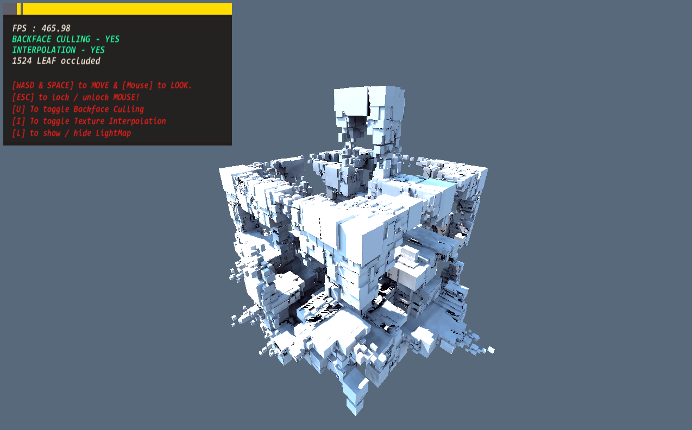
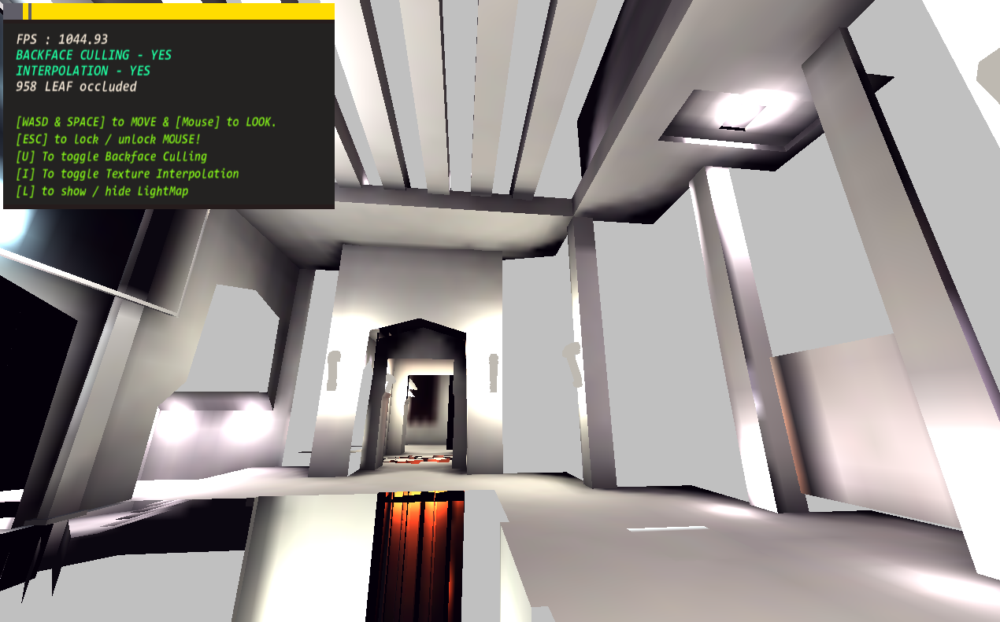
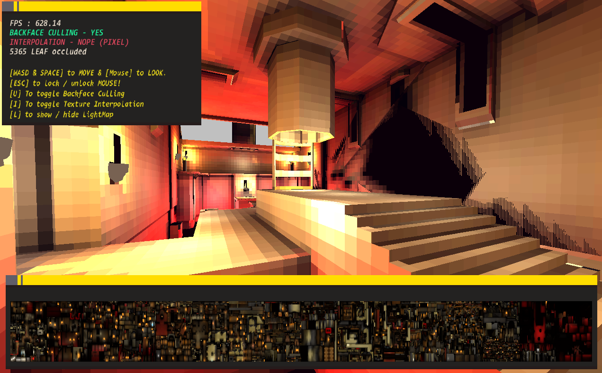

# GML-QUAKE3-BS-PEE (Legacy build)
*My previous attempt at loading and rendering quake 3 .bsp files.*

***This is a deprecated build, See [the main branch](https://github.com/TandyRum1024/gml-q3-bsp-loader/tree/master) for newer build!***

------------

# Implemented :
* PVS culling
* Basic level mesh building (no Bézier patches :/)
* Lightmaps only, No level texturing
* Supports only the `.bsp` file

# Current build pictures :

# Old development pictures :

:squirrel::squirrel::squirrel::squirrel::squirrel::squirrel::squirrel::squirrel::squirrel::squirrel::squirrel::squirrel::squirrel: